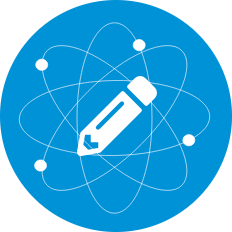

<p align="center">

</p>

# Nucleus

An open source collaborative text and code editor for the desktop

## Getting Started

Install dependencies:

``` bash
npm install
```

Build angular2 code and run current app locally:

``` bash
npm start
```

## Build

Install global dependencies:

``` bash
npm install electron-packager -g
```

Build for Mac

``` bash
electron-packager . --overwrite --platform=darwin --arch=x64 --icon=assets/icons/mac/icon.icns --prune=true --out=release-builds
```

Build for Windows

``` bash
electron-packager . electron-tutorial-app --overwrite --asar=true --platform=win32 --arch=ia32 --icon=assets/icons/win/icon.ico --prune=true --out=release-builds --version-string.CompanyName=CE --version-string.FileDescription=CE --version-string.ProductName="Nucleus"
```

Build for Linux

``` bash
electron-packager . electron-tutorial-app --overwrite --asar=true --platform=linux --arch=x64 --icon=assets/icons/linux/icon.png --prune=true --out=release-builds
```
